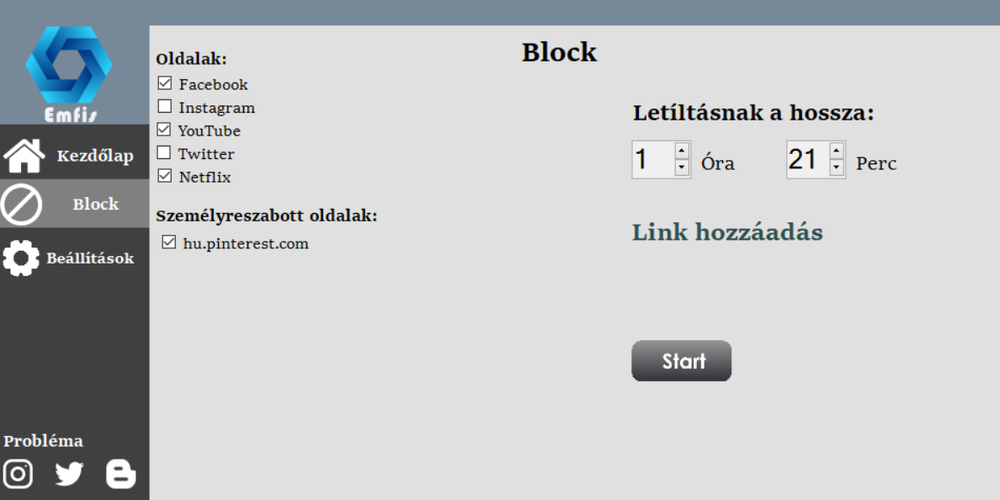
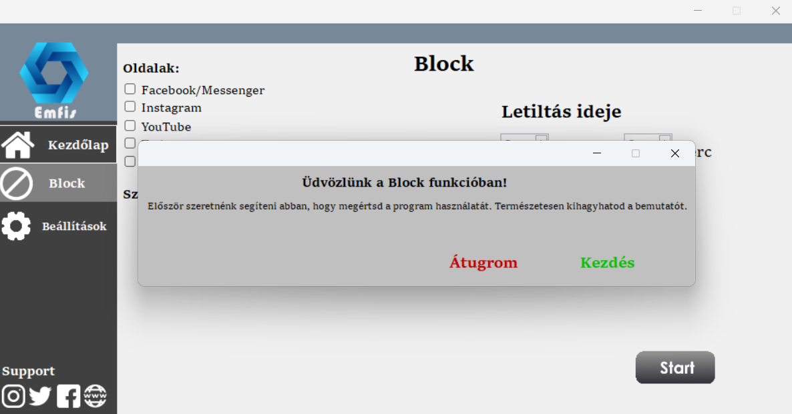

# Emfis
 

  
Emfis was a productivity application wich I developed in 2018-2019. This application is developed in Visual Basic and WinForms. The source code was lost over the years. But as a high schooler my code was not the best quality, so probably it's better for me I lost it :D  
With this application you can block sites for a time interval. On this period of time the chosen sites are not going to loaded regardless of your browser. Note: This project is a ""startup"" for Hungarian students. So everything in the software and the website will be in Hungarian.

# Links
- [Website](https://sites.google.com/view/emfis/kezd%C5%91lap)
- [Donwload Application](https://sourceforge.net/projects/emfis/)
- [Trailer](https://youtu.be/VWtNu21r0q8?si=L2GqK8Ct7Arqgvgf)

This project was participated in the "<19 Szabadfogású Számítógép verseny" competition.

# Screenshot

This is the block function. You can add custom links to your list. After you picked all the sites (from your own list or the pre-added) afther that you want to block you can set up the requermented time period. Push the start button and these sites will be unavailable unitl the timer expires.   

I developed a tutorial inside the software. If you never used this software before, a pop-up message will offer you a walkthrough. This tutorial teach the user fot the following: how to add properly custom links , set the timer, pick sites and start the blocker.

